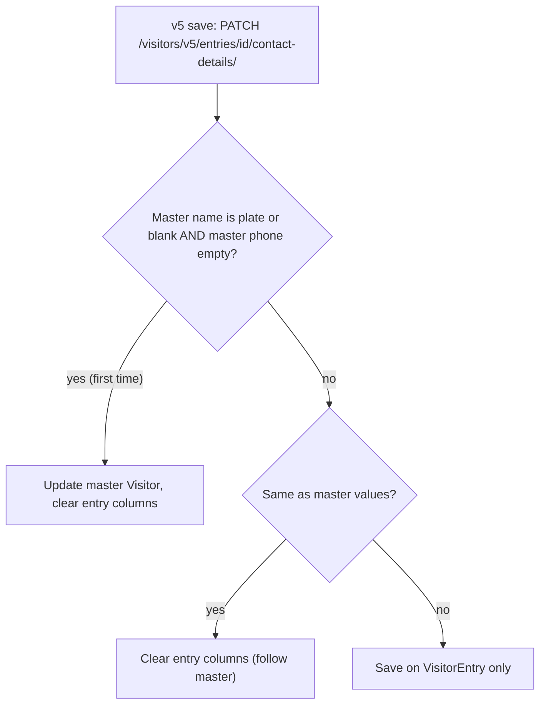

# CCTV entry contact details — phased plan (v5 only)

Guards add or edit the visitor name and phone number on a CCTV entry from a
popup.

- **First time** (the CCTV visitor still has no real details): the details go
  into the master `Visitor`, so every later entry for that plate shows them.
- **Later edits:** saved on that entry only (new `VisitorEntry` columns). The
  master `Visitor` is not changed.
- **Reading:** if the entry has its own value, use it; otherwise use the master
  `Visitor`'s value.

**Scope: only the v5 APIs change.** The v1 APIs (`/visitors/entries/…`,
`/visitors/reports/…`) keep their current behaviour and responses: they always
read and write the master `Visitor`. The web app (`GTMS_NEw`) uses only v5.

## Rules



| Rule | Detail |
|---|---|
| Read (v5, reports, Celery) | Entry value if not blank, else master `Visitor` value |
| First time | Master phone is empty and the master name is blank or the plate (the entry plate or the plate inside `CCTV-<plate>`) |
| v5 response | Same keys as today, plus one new key, `can_edit_details` |
| v1 | Unchanged (reads and writes the master `Visitor`) |

**Rollout safety:** until the edit icon ships (Phase 5), the popup only opens
while `needs_details` is true. That is the first-time case, which writes to the
master. So no per-entry values exist before Phase 5, and Phases 1–4 change
nothing users can see.

---

## Phase 1 — Foundation (DONE)

No behaviour change. v1 and v5 responses are identical to before.

- `VisitorEntry.visitor_name` (255) and `VisitorEntry.phone_number` (32),
  blank by default — [visitor/models.py](../visitor/models.py).
- Migration [0015_visitorentry_contact_details.py](../visitor/migrations/0015_visitorentry_contact_details.py)
  only adds these two columns.
- Shared helpers in [visitor/contact_details.py](../visitor/contact_details.py):
  - `entry_visitor_name(entry)`, `entry_phone_number(entry)` — entry value, else master;
  - `master_is_placeholder(visitor, plate)` — the "first time" rule;
  - `cctv_ic_plate(visitor)` — the plate inside `CCTV-<plate>`.
- Tests: `visitor.tests.EntryContactDetailsHelperTestCase` (no database
  needed).

Deploy:

```bash
cd /root/htdocs/ravi/gms/patrol_backend
git pull
../gtms_venv/bin/python manage.py migrate visitor
systemctl restart patrol_backend dapne_patrol_backend
```

Check: the web app and the mobile app behave exactly as before.

Note: `makemigrations visitor --dry-run` also lists older, unrelated
differences (index renames, `VisitorAsset.asset_type`). They are not part of
this work and were left out of migration 0015 on purpose.

## Phase 2 — v5 visitor GET APIs + save (DONE)

Tests: `visitor.tests.EntryContactDetailsV5TestCase` (no database needed). It
checks that the v1 keys and sources are unchanged, the v5 values, and the
first-save, later-edit and same-as-master save rules, plus v1 always writing
the master.

Search detail: in v5, the master name and phone are matched only when the
entry has no value of its own. So a search for "Ravi" doesn't find an entry
whose own name is "Kumar". The v5 Excel/PDF exports use the same filter; their
file contents change in Phase 3.

- **v5 serializer**, `VisitorEntrySerializerV5` in [visitor/serializers_v5.py](../visitor/serializers_v5.py):
  - `visitor_name` and `phone_number` use the helpers;
  - `needs_details` uses the entry values;
  - adds `can_edit_details` (true for CCTV entries).
  
  `VisitorEntrySerializer` (v1) is not touched.
  
  Every v5 entry response goes through `_v5_entry_payload` /
  `_attach_site_from_response` in [visitor/views_v5.py](../visitor/views_v5.py),
  so this covers:
  - list and detail;
  - check-in, invite, complete-invite;
  - approve, revert, cancel, reschedule, check-out;
  - QR scan;
  - contact-details.
- **Search:** `_filtered_entries(request, entry_contact=False)` in
  [visitor/views.py](../visitor/views.py). The v5 list and export pass
  `entry_contact=True`, which also matches `visitor_name__icontains` and
  `phone_number__icontains` on the entry. v1 calls are unchanged.
- **Save:** move the write in `VisitorEntryContactDetailsView._update` into a
  method, `_apply_contact(entry, visitor, name, phone)`.
  - v1 keeps today's behaviour (always writes the master).
  - `VisitorEntryContactDetailsViewV5` overrides it with the flow above.
  - Validation (required fields, digits only, name is not the plate) and
    `select_for_update` stay shared.
- **Not changed:** `VisitorSearchViewV5` (IC lookup). It returns the master
  `Visitor` on purpose.

Deploy: `systemctl restart patrol_backend dapne_patrol_backend`.

Check:
- v5 keys are unchanged apart from `can_edit_details`, and v1 is identical;
- a first save through v5 updates the master;
- a later v5 edit changes only that entry;
- v5 search finds the per-entry name and phone.

## Phase 3 — v5 report APIs (DONE)

Tests: `visitor.tests.EntryContactDetailsReportsTestCase` (no database needed).
It covers the export row and the overstay row with the switch off (v1) and on
(v5), and that a plate used as the name is still hidden in the overstay
report. The entry-aware search filter is shared:
`contact_details.contact_search_q`.

- **Visitor Excel/PDF export:** add `entry_contact=False` to
  `generate_visitor_excel`, `generate_visitor_pdf` and `_entry_export_row` in
  [visitor/exports.py](../visitor/exports.py). `VisitorEntryExportViewV5` and
  `VisitorEntryExportPdfViewV5` pass `True`.
- **Vehicle overstay report (screen, Excel, PDF):** add `entry_contact=False`
  to `build_vehicle_overstay_report` → `_row_from_entry`, and to its search, in
  [visitor/vehicle_overstay_report.py](../visitor/vehicle_overstay_report.py).
  `_display_visitor_name(name, plate)` now takes the name text. The shared
  `_vehicle_overstay_report_from_request` passes the switch through, and
  `_vehicle_overstay_report_from_request_v5` turns it on (`True`).
- **v1 report views are unchanged.** The vehicle movement report only has
  counts, so it needs no change.

Deploy: `systemctl restart patrol_backend dapne_patrol_backend`.

Check: in the v5 Excel, PDF and overstay report, an entry edited separately
shows its own name and phone, and other rows show the master values. v1
exports are unchanged.

## Phase 4 — Celery reports and alerts (DONE)

Tests (in `EntryContactDetailsReportsTestCase`):
- the overstay alert text and push data use the entry's own name, or the
  master's when it has none;
- the scheduled visitor Excel/PDF and the overstay data pass
  `entry_contact=True`.

The push data `visitor_name` (`notifications.services._entry_payload`) uses the
same rule for every entry notification. Manual entries never have their own
values, so their notifications are unchanged.

These are background jobs, not v1 APIs, so they follow the new rule (same as
v5).

- **Scheduled report emails** (`reports/tasks.py` →
  [reports/services/report_generator.py](../reports/services/report_generator.py)):
  `_visitor_generate` passes `entry_contact=True` to
  `generate_visitor_excel/pdf`, and the overstay item passes it to
  `build_vehicle_overstay_report`.
- **Vehicle overstay alert** (`visitor.tasks.check_vehicle_overstay` →
  [visitor/overstay.py](../visitor/overstay.py) →
  [notifications/services.py](../notifications/services.py), "Visitor: …"):
  use `entry_visitor_name(entry)`.
- Approval, revert, cancel and reschedule notifications are for manual
  entries, which never have per-entry values, so they need no change.

Deploy: `systemctl restart patrol_celery`. The ANPR services don't need a
restart.

Check:
- run `send_org_report_email_now` for a test config: the attachments match the
  v5 exports;
- an overstay alert for an edited entry shows that entry's name.

## Phase 5 — Frontend (turns the feature on) (DONE for web)

Web changes made:
- `canEditCctvDetails(entry)` (a CCTV entry, and `can_edit_details` not
  `false`) replaces `canAddCctvDetails`;
- the table row and the detail modal show `FiPlus` "Add…" while
  `needs_details`, otherwise `FiEdit2` "Edit…";
- the dialog title is "Add visitor details" or "Edit visitor details".

Checked: ESLint shows no new errors (the 11 errors reported already exist in
the committed files), and `vite build` succeeds.

### Mobile team handoff

- Endpoint (unchanged): `PATCH /visitors/v5/entries/<id>/contact-details/`
  with body `{ "visitor_name": "...", "phone_number": "..." }`. The response is
  the v5 entry, same keys as before.
- New response key on v5 entries: `can_edit_details` (true for CCTV entries).
  Nothing was removed or renamed.
- `visitor_name` / `phone_number` in v5 now show the entry's own values when
  the entry was edited separately, otherwise the visitor's.
- What to change:
  - show the icon for every entry with `can_edit_details == true`
    ("Add" while `needs_details`, else "Edit");
  - pre-fill the popup from the entry's `visitor_name` / `phone_number`
    (leave the name empty if it equals `vehicle_number`);
  - after saving, replace only that entry with the response (or reload the
    list). Don't copy the name to other entries of the same vehicle.

Web, `GTMS_NEw` (already uses v5):

- `src/pages/visitor/VisitorHistory.jsx`:
  - show the icon for every CCTV entry (`can_edit_details`, or
    `entry_source === 'cctv'`);
  - `needs_details` true: `FiPlus` "Add visitor name & phone";
  - otherwise: `FiEdit2` "Edit visitor name & phone";
  - do the same for `canAddDetails` passed to the detail modal.
- `src/components/visitor/VisitorEntryDetailModal.jsx`: the same icon and
  tooltip switch.
- `src/components/visitor/CctvContactDetailsDialog.jsx`: it already pre-fills
  `visitor_name` / `phone_number` (leaving the name blank when it is the plate).
  Only the title changes: "Add visitor details" or "Edit visitor details".

Mobile team (v5 endpoints):

- same endpoint, request body and response keys, plus `can_edit_details`;
- show the icon on every CCTV entry, pre-fill the popup from the entry, and
  after saving update only that row (or reload the list).

Check end to end:
- the first save goes to the master;
- a later edit changes only that entry;
- the next camera entry shows the master values;
- v5 exports, the overstay report, scheduled emails and overstay alerts follow
  the read rule;
- v1 is unchanged.
