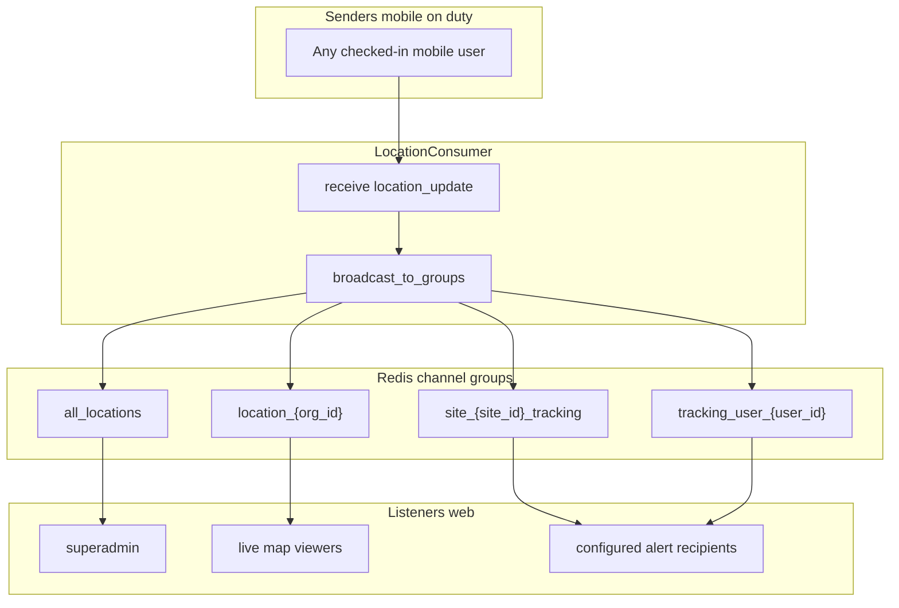

# Site Boundary & Live Tracking Alerts Plan

**Status:** Phase 7 complete  
**Last updated:** 2026-09-01

## In one sentence

**Admin configures each site (boundary + who gets alerts). While a user is checked in until checkout, the system tracks GPS, alerts when they leave the boundary or stop sending location, and notifies configured roles who have access to that site.**

---

## Reference — scope rules

### Attendance radius vs site boundary (do not mix)

| | Attendance radius (today) | Site boundary (new) |
|---|---|---|
| **What** | Small circle at punch time | Circle or polygon drawn by admin |
| **When** | Check-in / checkout punch only | Every GPS update while checked in |
| **Who sets** | Org `attendance_distance` | Admin per site |

Attendance punch radius stays **unchanged**.

### Monitoring window

```
CHECK-IN ──────────────────────────────────────────────► CHECKOUT
   │  GPS + boundary checks + alerts                         │ stop all
```

- **Who sends GPS:** Any mobile user with open check-in (not guard-only).
- **Before check-in / after checkout:** No monitoring, no alerts.

### Two alert types

| Alert | Code | Trigger |
|-------|------|---------|
| Boundary breach | `boundary_breach` | GPS received, position **outside** site boundary |
| Location missing | `location_missing` | Checked in, **no GPS** for configured timeout |

**Manual SOS** (`emergency_alert`) — separate, user-triggered panic.

### Boundary alert state machine

- Alert on **inside → outside** only (not every GPS ping while outside).
- **Outside → inside** resolves active breach.
- **Inside → outside again** = **new alert**.
- Optional **still-outside reminder** after N min (org setting, default **off**).

Store on `UserLiveLocation`: `boundary_state` (`inside`/`outside`), `active_breach_alert_id`, `last_location_at`.

### Alert storage

**Do not use** `notifications.NotificationLog` (visitor-only). Use new tables in `livetracking`:

- `TrackingAlert` — alert history
- `TrackingAlertRecipient` — per-user delivery + read state
- `SiteAlertRecipientConfig` — per site, per role (dynamic org roles)

**Recipient delivery:** Config = which roles per site. Runtime = users in those roles who have **site access** (`UserSite` / `all_org_sites`).

### Polygon storage (MySQL JSON on `LocationSite`)

```json
[[3.08510, 101.69050], [3.08580, 101.69120], [3.08600, 101.69000], [3.08510, 101.69050]]
```

Order: `[latitude, longitude]` — not GeoJSON `[lng, lat]`.

---

## Phase 1 — Database & models

**Goal:** Schema for boundaries, alerts, and recipient config.  
**Status:** Ready to implement (blocked in Plan mode — switch to **Agent** mode to apply).

### Tasks

- [x] Extend `LocationSite` in [`scheduler/models.py`](scheduler/models.py):
  - `boundary_type` (`none` / `circle` / `polygon`)
  - `boundary_radius_m`, `boundary_polygon` (JSONField)
  - `boundary_enabled`
- [x] Add to [`livetracking/models.py`](livetracking/models.py):
  - `TrackingAlert`
  - `TrackingAlertRecipient`
  - `SiteAlertRecipientConfig` (site + Role FK + `notify_boundary_breach` + `notify_location_missing`)
- [x] Extend `UserLiveLocation`:
  - `assigned_site`, `is_inside_boundary`, `boundary_state`, `last_location_at`, `active_breach_alert`
- [x] Migrations: `scheduler/0023_...`, `livetracking/0002_...`
- [x] Serializers: extend `LocationSiteSerializer`; new `livetracking/serializers.py`
- [x] Admin: new `livetracking/admin.py`

### Deliverable

DB ready; no UI or runtime logic yet.

### Phase 1 migration commands (after code merge)

```bash
cd backendnew/gtms/patrol_backend
../venv/bin/python manage.py makemigrations scheduler livetracking
../venv/bin/python manage.py migrate
../venv/bin/python manage.py check
```

---

## Phase 2 — Boundary math & org settings

**Goal:** Reusable geometry + global toggles.

### Tasks

- [x] New [`patrol_backend/utils/boundary_utils.py`](patrol_backend/utils/boundary_utils.py):
  - `is_point_in_circle()`, `is_point_in_polygon()`, `evaluate_site_boundary()`
  - Exit buffer from org setting (reduce GPS jitter)
- [x] `SiteSetting` keys (org-level) — migration `0024_seed_boundary_site_settings`:
  - `boundary_monitoring_enabled` (default off)
  - `boundary_exit_buffer_m`
  - `boundary_still_outside_reminder_min` (0 = off)
  - `location_missing_timeout_min`
- [x] Helper: `is_boundary_monitoring_active(org_id, site)` — global + per-site `boundary_enabled`

### Deliverable

Boundary can be evaluated in Python; org can turn feature on/off.

---

## Phase 3 — Django Channels / WebSocket (extend roles & groups)

**Goal:** Upgrade [`livetracking/consumers.py`](livetracking/consumers.py) and frontend WS client — today Channels is **hard-coded to a few roles**; this phase opens it for all on-duty senders and dynamic alert recipients.

### Current limitations (today)

| Area | Current behavior |
|------|------------------|
| **Who can send GPS** | Any authenticated user (no on-duty check); docs say guard-only but not enforced |
| **Who listens (live map)** | `superadmin` → `all_locations`; `admin` / `so` / `fo` → `location_{org_id}`; **guard joins no group** |
| **Roles** | Hard-coded strings — **dynamic/custom org roles not supported** |
| **Site scope** | Org-level groups only — **no per-site alert groups** |
| **Message types** | `location_update`, `emergency_alert` only |
| **REST live map** | `last-known-locations` filters `role=guard` only |

### Target architecture



### Group membership on `connect()`

| User type | Groups to join |
|-----------|----------------|
| **Superadmin** | `all_locations` |
| **Live map viewer** (admin / SO / FO / roles with Live Tracking menu) | `location_{org_id}` |
| **Alert recipient** (role in `SiteAlertRecipientConfig` + site access) | `tracking_user_{user_id}` **and** `site_{site_id}_tracking` for each allowed site |
| **On-duty mobile sender** | No listen groups required (send-only) — same as guard today |

**Dynamic roles:** Resolve listener eligibility from `Role` + `SiteAlertRecipientConfig`, not hard-coded `['admin','so','fo']`.

### Who can **send** `location_update`

- Any authenticated user with **open `AttendanceCheckin`** (check-in → checkout).
- Reject GPS if not on duty (Phase 4 enforces; stub check in this phase).

### New / updated WebSocket message types

| Direction | `type` | Purpose |
|-----------|--------|---------|
| Client → Server | `location_update` | GPS ping (on-duty only) |
| Client → Server | `emergency_alert` | Manual SOS (unchanged) |
| Server → Client | `location_update` | Live position + `boundary_status`, `assigned_site_id`, `is_inside_boundary` |
| Server → Client | `tracking_alert` | Boundary breach / location missing to **recipients** |
| Server → Client | `emergency_alert` | Manual SOS broadcast (unchanged) |

### Tasks

- [x] Refactor `connect()` / `disconnect()` — dynamic group join via helper `resolve_ws_groups_for_user(user)`
- [x] Add groups: `site_{site_id}_tracking`, `tracking_user_{user_id}`
- [x] On site alert config change: optional regroup connected clients (or reconnect on next login)
- [x] Add outbound handler `tracking_alert(event)` on consumer
- [x] Enrich `location_update` broadcast payload (boundary fields)
- [x] [`GTMS_NEw/src/services/websocket.jsx`](GTMS_NEw/src/services/websocket.jsx): handle `tracking_alert`; support non-guard users in state
- [x] [`livetracking/routing.py`](livetracking/routing.py) — no route change (`ws/live-location/`)
- [ ] Document WS contract in plan appendix / mobile doc (Phase 11)

### Deliverable

Channels supports **all on-duty senders**, **dynamic role-based alert recipients**, and **site-scoped alert groups** — not limited to guard + admin/so/fo.

---

## Phase 4 — Check-in gate & live location REST

**Goal:** Server-side on-duty enforcement + REST aligned with new WS model.

### Tasks

- [x] In `handle_location_update`:
  - Reject if no open `AttendanceCheckin`
  - Resolve site from `AttendanceCheckin.site`
  - Update `UserLiveLocation` (`last_location_at`, `assigned_site`, etc.)
- [x] [`livetracking/views.py`](livetracking/views.py):
  - `last-known-locations`: on-duty users (open check-in), **not** `role=guard` only
  - Return boundary status fields
- [x] History API: same on-duty scope

### Deliverable

REST live map matches WebSocket — all on-duty roles visible, not guard-only.

---

## Phase 5 — Alert engine (create, resolve, notify)

**Goal:** Create `TrackingAlert` rows and resolve recipients by role + site access.

### Tasks

- [x] New [`livetracking/alert_service.py`](livetracking/alert_service.py):
  - `create_tracking_alert(...)`, `resolve_tracking_alert(...)`
  - `get_recipients_for_alert(site, alert_type)` — `SiteAlertRecipientConfig` + [`authapp/site_access.py`](authapp/site_access.py)
  - `dispatch_tracking_alert_ws(alert, recipients)` — uses Phase 3 groups (`tracking_user_{id}`, `site_{site_id}_tracking`)
- [x] REST API: alerts inbox, mark read, site recipient config CRUD

### Deliverable

Alerts persist in separate table; WS dispatch wired to new groups.

---

## Phase 6 — Boundary breach & location missing (runtime)

**Goal:** Fire alerts at the right times with state machine; push via Phase 3 WebSocket.

### Tasks

- [x] In `handle_location_update` (after Phase 4 gate):
  1. `boundary_utils` → update `boundary_state`
  2. **inside → outside:** create `TrackingAlert` + `dispatch_tracking_alert_ws`
  3. **outside → inside:** resolve breach
  4. Update `last_location_at` → resolve `location_missing`
- [x] Optional still-outside reminder (org setting)
- [x] Background job: `location_missing` when no GPS past timeout (Celery Beat: `check-location-missing-alerts` every 2 min)
- [x] On checkout: resolve alerts; clear boundary state

### Deliverable

Both alert types end-to-end: DB + WebSocket to configured recipients.

---

## Phase 7 — Organization UI (tabs + site management)

**Goal:** Admin configures sites, boundaries, and alert recipients.

### Tasks

- [x] Refactor [`Organization.jsx`](GTMS_NEw/src/pages/organisation/Organization.jsx):

**Tab 1 — Organization**
- Create/edit org: name, address, QR / face / AI flags
- Remove inline “Authorized Sites” list from org dialog

**Tab 2 — Sites**
- Site table per org
- Create / Edit site (dialog or route) with:
  1. Basic: name, lat, lng
  2. Boundary: type dropdown, map (circle or polygon), `boundary_enabled`
  3. Alert recipients: matrix of org roles × (boundary breach | location missing)

- [x] New component e.g. `SiteForm.jsx`, `SiteBoundaryMap.jsx`
- [x] Google Maps Drawing library (`libraries: ['drawing']`)
- [x] Wire to extended `/scheduler/locations/{id}/sites/` + alert config API

### Deliverable

Admins can draw boundaries and configure alert roles per site without touching visitor notifications.

---

## Phase 8 — Site Settings UI (global toggles)

**Goal:** Org-wide master switch and timeouts.

### Tasks

- [ ] [`SiteSettings.jsx`](GTMS_NEw/src/pages/settings/SiteSettings.jsx) — add keys:
  - Enable boundary monitoring
  - Exit buffer (meters)
  - Still-outside reminder (minutes, 0 = off)
  - Location missing timeout (minutes)
- [ ] Backend seed/default values for new orgs

### Deliverable

Org admin can enable feature and tune thresholds before per-site setup.

---

## Phase 9 — Header icons & tracking alerts inbox

**Goal:** Separate visitor notifications from tracking alerts in UI.

### Tasks

- [ ] [`DashboardLayout.jsx`](GTMS_NEw/src/pages/DashboardLayout.jsx):
  - **Visitor icon** → `/notifications` (existing `NotificationLog`)
  - **Tracking alert icon** → `/tracking-alerts` (`TrackingAlert`)
  - Separate unread badges
- [ ] New `TrackingAlertHistory.jsx` + `api/trackingAlerts.js`
- [ ] List, filter by type/site, mark read, link to live map
- [ ] WebSocket listener → `gtms-tracking-alerts-updated` for badge refresh
- [ ] Clarify visitor page title/icon (visitor-only)

### Deliverable

Recipients see tracking alerts in dedicated inbox; visitor flow unchanged.

---

## Phase 10 — Live map UI

**Goal:** Visual boundaries, status, and real-time alerts on map.

### Tasks

- [ ] [`LiveTrackingMap.jsx`](GTMS_NEw/src/pages/livetracking/LiveTrackingMap.jsx):
  - Load site boundaries → render `Circle` / `Polygon` overlays
  - Marker colors: inside / outside / location missing
  - Breach filter card
- [ ] [`websocket.jsx`](GTMS_NEw/src/services/websocket.jsx):
  - Handle `tracking_alert`, `boundary_breach` broadcast
  - Preserve alert flags across `location_update`
  - Toast/banner on new alert
- [ ] Optional: auto-pan to alerting user

### Deliverable

Ops team sees boundaries and alert state on live map.

---

## Phase 11 — Mobile app contract

**Goal:** Document and align mobile team (code outside this repo).

### Tasks

- [ ] Written contract:
  - Connect WS + start GPS **after check-in**
  - Send `location_update` every N seconds until **checkout**
  - Stop GPS on checkout
  - Manual SOS: `emergency_alert` unchanged
- [ ] Server rejects GPS outside check-in window regardless

### Deliverable

Mobile behavior matches server assumptions.

---

## Phase summary

| Phase | Focus | Depends on |
|-------|--------|------------|
| **1** | DB & models | — |
| **2** | Boundary utils + org SiteSettings keys | 1 |
| **3** | **Django Channels / WebSocket** — groups, dynamic roles, new message types | 1 ✅ |
| **4** | Check-in gate + live location REST | 1, 3 ✅ |
| **5** | Alert engine + REST inbox APIs | 1, 3 ✅ |
| **6** | Boundary breach + location-missing runtime | 2, 4, 5 ✅ |
| **7** | Organization tabs + site/boundary/alert UI | 1, 5 ✅ |
| **8** | Site Settings global toggles UI | 2 |
| **9** | Header dual icons + tracking inbox (+ WS `tracking_alert`) | 5, 6 |
| **10** | Live map overlays + WS UX | 3, 6 |
| **11** | Mobile contract | 3, 4, 6 |

**Suggested build order:** 1 → 2 → **3** → 4 → 5 → 6 → (7 + 8 parallel) → 9 → 10 → 11

**Note:** Phase **3** is the dedicated socket phase — do not skip; Phases 5–6 and 9–10 depend on the new groups and `tracking_alert` messages.

---

## Files to change (by area)

| Area | Files |
|------|--------|
| Models | `scheduler/models.py`, `livetracking/models.py` |
| Boundary | `patrol_backend/utils/boundary_utils.py` |
| Alerts | `livetracking/alert_service.py`, `livetracking/views.py`, `livetracking/urls.py` |
| WebSocket / Channels | `livetracking/consumers.py`, `livetracking/routing.py`, `websocket.jsx` |
| Site access | `authapp/site_access.py` (reuse) |
| Org / sites UI | `Organization.jsx`, `SiteForm.jsx`, `SiteBoundaryMap.jsx` |
| Settings UI | `SiteSettings.jsx` |
| Header / inbox | `DashboardLayout.jsx`, `TrackingAlertHistory.jsx`, `api/trackingAlerts.js` |
| Live map | `LiveTrackingMap.jsx`, `websocket.jsx` |

**Do not modify** `notifications.NotificationLog` for tracking alerts.

---

## Done when

- [ ] Phases 1–6 complete (backend + **WebSocket** fully functional)
- [ ] Phases 7–8 complete (admin can configure sites + global settings)
- [ ] Phases 9–10 complete (recipients notified in UI + live map)
- [ ] Phase 11 documented for mobile
- [ ] Circle OR polygon per site; check-in → checkout only
- [ ] Boundary breach + location missing alerts with correct state machine
- [ ] Per-site role config; delivery respects site access
- [ ] Separate `TrackingAlert` table; dual header icons
- [ ] Attendance punch radius unchanged
