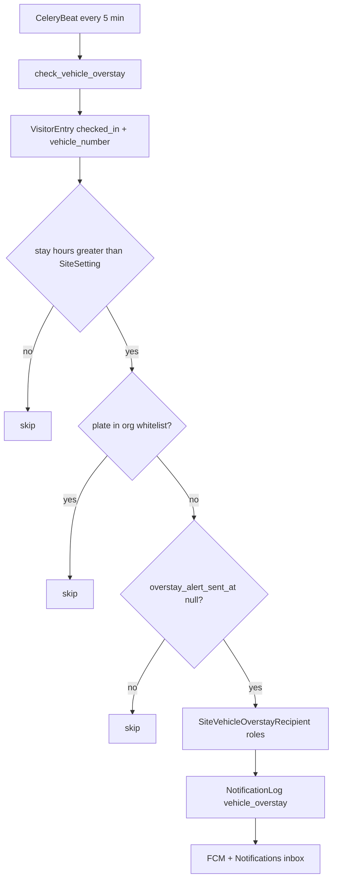

# Vehicle Overstay SOS — Phased Plan

**Status:** Phase 1–3 complete  
**Last updated:** 2026-09-23  

**Phase 2 API detail:** [`VEHICLE_OVERSTAY_PHASE2.md`](VEHICLE_OVERSTAY_PHASE2.md)  
**Phase 3 API detail:** [`VEHICLE_OVERSTAY_PHASE3.md`](VEHICLE_OVERSTAY_PHASE3.md)  
Related UX: CCTV contact details → [`MOBILE_CCTV_CONTACT_DETAILS_API.md`](MOBILE_CCTV_CONTACT_DETAILS_API.md)

## In one sentence

While a vehicle stay is still **checked in**, if duration exceeds an org setting (e.g. 4h) and the plate is **not** whitelisted, send an **overstay SOS once** to roles configured **per site** (same inbox family as boundary tracking alerts).

## Decisions (locked)

| Topic | Decision |
|--------|----------|
| Trigger | Still **`checked_in`** (not after checkout) |
| Who | Any entry with non-empty `vehicle_number` (CCTV + manual) |
| Threshold | Org `SiteSetting` `vehicle_overstay_hours` (default `4`) |
| Alert frequency | **Once per visit** (`VisitorEntry.overstay_alert_sent_at`) |
| Whitelist | **Org-wide** plates (`VehicleOverstayWhitelist`); site-wise later |
| Recipients | **Per site** role list (e.g. Site A → FO+SO; Site B → SO) |
| Delivery | `NotificationLog` + FCM → **Notifications** inbox (visitor) |
| UI | Reuse existing Visitor tables / filters / pagination patterns |

## Architecture



## Phase overview

| Phase | Goal | Status |
|-------|------|--------|
| **1** | Visitors table: Name + Phone columns; search includes name/phone | **Done** |
| **2** | Threshold setting + org whitelist UI/API + Celery detector (notify stub) | **Done** |
| **3** | Per-site recipient roles + SOS via visitor NotificationLog | **Done** |

Do **one phase at a time**.

---

## Phase 1 — Visitors Name / Phone (+ search) — Done

### Delivered

- [`VisitorHistory.jsx`](../../../../GTMS_NEw/src/pages/visitor/VisitorHistory.jsx): **Name** and **Phone** columns after Visitor
- CCTV plate-as-name shows as `—` in Name until contact details filled
- Search placeholder: name / phone / IC / vehicle
- Backend search already matched `visitor_name` + `phone_number` in `_filtered_entries`
- Excel/PDF export already had Visitor Name + Phone

### Out of scope here

- Contact-details PATCH (`needs_details`) — separate CCTV feature (already shipped earlier)

---

## Phase 2 — Threshold + whitelist + worker — Done

### Delivered

| Piece | Detail |
|-------|--------|
| Setting | `vehicle_overstay_hours` seeded on `SiteSetting` (default `4`, unit `h`) |
| Model | `VehicleOverstayWhitelist` (org `location` + normalized plate) |
| Field | `VisitorEntry.overstay_alert_sent_at` |
| APIs | List / create / delete whitelist; vehicle suggestions by header `site_id` |
| UI | Visitor tab **Overstay Whitelist** (`/visitor/overstay-whitelist`) — table like Visitors |
| Worker | Celery Beat `visitor.tasks.check_vehicle_overstay` every 5 minutes |
| Notify | **Stub** — `try_send_vehicle_overstay_alert` returns `false`; does **not** mark sent |

### Key files

- [`visitor/models.py`](../visitor/models.py) — whitelist + `overstay_alert_sent_at`
- [`visitor/overstay.py`](../visitor/overstay.py) — detection logic
- [`visitor/tasks.py`](../visitor/tasks.py) — Celery task
- [`visitor/views_overstay.py`](../visitor/views_overstay.py) — whitelist + suggestions
- [`VehicleOverstayWhitelist.jsx`](../../../../GTMS_NEw/src/pages/visitor/VehicleOverstayWhitelist.jsx)

### Ops

```bash
python manage.py migrate visitor
# restart celery worker + beat
```

---

## Phase 3 — Per-site roles + SOS delivery — Done

### Delivered

- Model **`SiteVehicleOverstayRecipient`**: `site` → `LocationSite`, `recipient_role` → `Role`, unique `(site, recipient_role)`
- `NotificationLog.TYPE_VEHICLE_OVERSTAY` + `notify_vehicle_overstay` (FCM + history)
- `try_send_vehicle_overstay_alert` → visitor notifications (not TrackingAlert)
- APIs: GET/PUT `/visitors/v5/overstay-alert-recipients/`
- Visitor tab **Overstay Alert Roles** (`/visitor/overstay-alert-roles`)
- Notifications inbox label for `vehicle_overstay`
- Docs: [`VEHICLE_OVERSTAY_PHASE3.md`](VEHICLE_OVERSTAY_PHASE3.md)
- Livetracking: temporary `vehicle_overstay` TrackingAlert path **reverted** (`0005`)

### Wire Phase 2 worker

- Stub replaced; marks `overstay_alert_sent_at` only when notify succeeds
- No roles / no matching users → deferred (null sent_at)

### Out of scope (later)

- Site-wise whitelist
- Repeat reminders while still overstay
- CCTV-only filter

---

## Related earlier work (not part of this plan’s phases)

| Item | Notes |
|------|--------|
| CCTV `visit_date` from org admin TZ | Gate stamp fix |
| CCTV contact details (`needs_details` + PATCH) | Name/phone modal |
| ANPR frozen RTSP / rearm | Separate reader deploy |

---

## Ops checklist

- [ ] Migrate `visitor.0013` + `visitor.0014` + `livetracking.0005` (reverts 0004)
- [ ] Celery beat running with `check-vehicle-overstay`
- [ ] Configure **Overstay Alert Roles** per site
- [ ] Confirm alerts appear on **Notifications** (visitor inbox)
