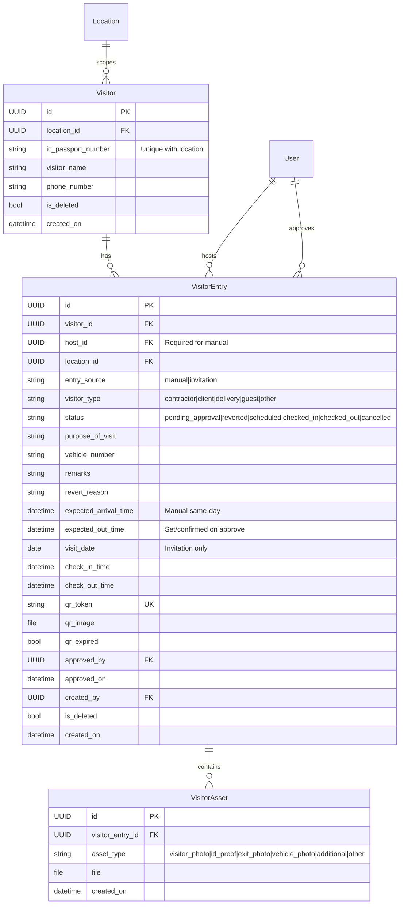

# GTMS Visitor Management — Implementation Plan

Revised plan for the **Visitor Entry & Visitor Management** module.

**Locked decisions**
- **Iteration 1 = manual entry + host approval workflow** (models + APIs + web). AI/OCR is **Iteration 2**.
- Invitations (`visit_date`, no host approval) are **Iteration 3**.
- `ic_passport_number` is **unique per location** (not global).
- **No `document_type` field** — AI will detect document type later when OCR lands.
- Manual entry is **same-day only** — no `visit_date` on manual.
- `visit_date` is **invitation only** (future visits).
- **Manual entry requires host approval.** Host approve **= check-in**.
- **Invitation does not need host approval.** Scanning invite QR **= check-in**.
- Checkout (QR or manual mark) always requires **checkout image**; then **QR expires**.
- Push notifications — **deferred** (do later).
- When AI lands: OCR/plate results always **editable** (AI pre-fills; never blocks flow).

Aligns with GTMS conventions: app prefix `/visitors/`, location scoping, soft delete, JWT auth, Excel export, `MOBILE_API_CURL.md`.

---

## Why this order (manual + approval → AI → invitations)

| Approach | Verdict |
|----------|---------|
| **A. Manual + approval first, AI second, invite third (this plan)** | **Preferred.** Gatehouse + host workflow ships without ML risk. Invite reuses same entry/QR model. |
| **B. AI + manual together early** | Riskier. YOLO/PaddleOCR on critical path. |

---

## Core product rules

### Manual entry (same-day walk-in)
1. Guard fills form (visitor photo + IC copy required; additional images optional multi).
2. Host is **required**.
3. Submit creates entry as `pending_approval` + generates QR.
4. Host reviews:
   - **Approve** (+ optional `expected_out_time`) → status `checked_in`, `check_in_time=now()` (**approve = check-in**).
   - **Revert** (+ reason) → status `reverted`; guard corrects and **resubmits**.
   - **Cancel** → status `cancelled`, `qr_expired=true`.
5. If QR scanned while still `pending_approval` → response: **“Not approved yet”**.

### Invitation (future visit) — Iteration 3
1. Create invitation with **`visit_date`** (+ visitor details, host, QR).
2. Status starts as `scheduled`.
3. **No host approval step.**
4. On visit day, scan QR → **check-in** (`checked_in`).
5. Checkout same as manual.

### Checkout (both methods)
| Method | Rule |
|--------|------|
| Scan QR while `checked_in` | Opens checkout; **checkout image required** |
| Manual “Mark Exit” | Same; **checkout image required** |

After checkout → `checked_out`, `qr_expired=true`.

### QR lifecycle (single token, status-driven)
| Status | QR scan result |
|--------|----------------|
| `pending_approval` | `awaiting_approval` — not approved yet |
| `reverted` | `reverted` — guard must resubmit |
| `scheduled` | Check-in (invitation) |
| `checked_in` | `checkout` — proceed with image |
| `checked_out` / `cancelled` / `qr_expired` | Expired / invalid |

---

## 1. Database design

Three tables in Django app `visitor`:

### Assets rules
| Asset | Cardinality |
|-------|-------------|
| `visitor_photo` | **1** (required on manual submit) |
| `id_proof` | **1** (required on manual submit) |
| `additional` | **many** (optional) |
| `exit_photo` | **1** (required on checkout) |
| `vehicle_photo` | 0–1 (optional; used later for plate OCR) |

Each image is **one row** in `VisitorAsset` linked by `visitor_entry_id`.

### Constraints & conventions
| Rule | Detail |
|------|--------|
| IC uniqueness | `UniqueConstraint(location, ic_passport_number)` where `is_deleted=False` |
| Location scoping | Non-superuser locked to `request.user.location`; superadmin may pass `location_id` |
| Soft delete | `is_deleted` on Visitor / VisitorEntry |
| Statuses | `pending_approval`, `reverted`, `scheduled`, `checked_in`, `checked_out`, `cancelled` |
| Manual vs invite | Manual: no `visit_date`. Invite: has `visit_date`, starts `scheduled` |
| QR | One token; usable based on status; expired after checkout/cancel |
| No document_type | Not stored; AI decides document kind later |

---

## 2. API surface (GTMS style — `/visitors/`)

Auth: `Authorization: Bearer <token>` on all endpoints.

### Iteration 1 — Manual + approval + checkout (implemented)

| Method | Path | Purpose |
|--------|------|---------|
| `GET` | `/visitors/search/?ic_number=` | Lookup visitor profile in current location |
| `POST` | `/visitors/entries/checkin/` | Manual submit → `pending_approval` + QR; multipart assets; optional `entry_id` to resubmit after revert |
| `POST` | `/visitors/entries/<id>/approve/` | Host approve = check-in; optional `expected_out_time` |
| `POST` | `/visitors/entries/<id>/revert/` | Host revert with reason |
| `POST` | `/visitors/entries/<id>/cancel/` | Cancel; set `qr_expired` |
| `POST` | `/visitors/entries/<id>/checkout/` | Checkout; **`exit_photo` required**; set `qr_expired` |
| `POST` | `/visitors/qr-scan/` | Body `{ qr_token }` → action by status |
| `GET` | `/visitors/entries/` | History filters: `date_filter`, `status`, `location_id`, `search`, `mine` |
| `GET` | `/visitors/entries/export/` | Excel (same filters) |

### Iteration 2 — AI extraction (prefill helpers)

| Method | Path | Purpose |
|--------|------|---------|
| `POST` | `/visitors/ocr-id/` | Multipart: `id_proof` → `{ extracted_id, confidence?, raw_lines? }` (no stored document_type) |
| `POST` | `/visitors/detect-plate/` | Multipart: `vehicle_image` → `{ plate_number }` |

Helpers only; never block submit/approve/checkout.

### Iteration 3 — Invitations

| Method | Path | Purpose |
|--------|------|---------|
| `POST` | `/visitors/invitations/` | Create `scheduled` entry + QR + **`visit_date`** |
| `GET` | `/visitors/invitations/` | List scheduled / cancelled invites |
| `POST` | `/visitors/invitations/<id>/cancel/` | Cancel invite; QR expires |
| `GET` | `/visitors/hosts/` | Host autocomplete (or reuse users API) |

QR scan for `scheduled` already defined in Iter 1 `qr-scan`.

### Manual submit logic
1. Resolve `location` from JWT (or superadmin param).
2. Require `host_id`.
3. Upsert `Visitor` on `(location, ic_passport_number)`.
4. If `entry_id` and status is `reverted` → update and set `pending_approval`.
5. Else create `VisitorEntry` (`entry_source=manual`, `pending_approval`) + QR.
6. Save assets (`visitor_photo`, `id_proof`, `additional`…).

### Host approve logic (= check-in)
1. Caller must be host (or superadmin).
2. Status must be `pending_approval` (or allow from `reverted` if product wants).
3. Set `checked_in`, `check_in_time=now()`, `approved_by`, `approved_on`.
4. Optionally set `expected_out_time`.

### QR scan logic
- `pending_approval` → awaiting_approval  
- `reverted` → reverted message  
- `scheduled` → check-in  
- `checked_in` → checkout payload  
- `checked_out` / `cancelled` / `qr_expired` → expired  

---

## 3. AI/ML Extraction Pipeline (Backend-Only) — Iteration 2

Modular image pipeline on Django using:
- **YOLOv8-nano (Ultralytics)** — localize license plates (~6MB, CPU-friendly).
- **PaddleOCR** — read text from cropped regions / ID cards.
- **Pillow** — crop / light preprocess.

Models load **lazily**. On timeout/failure, APIs return `success: false`; UI keeps manual typing.

### Pipeline A: Vehicle license plate
Raw image → YOLOv8 crop → PaddleOCR → regex clean → `plate_number`

### Pipeline B: ID card
PaddleOCR → try MyKad / Aadhaar / DL / passport patterns (no stored document_type field; optional client-side hint only for Iter 2 if useful).

**Ops notes**
- Pin in `requirements-visitor-ai.txt`.
- Soft timeout (~5–8s).
- Separate from face-attendance stack.

---

## 4. Web panel

**Top-level module** (like Incident):
- Sidebar: **Visitor** (`Role.pages` + `menuConfig`)
- Routes: `/visitor/manual-entry`, `/visitor/history`, invitations (Iter 3)

### Iteration 1 screens
1. **Manual Entry** — Documents (visitor photo, IC copy, additional multi) → Visitor identity (IC, name, phone, type, **host required**, expected arrival) → Visit details → **Submit for approval** → QR modal (“pending host approval”)
2. **Visitor History** — filters, details, host actions:
   - **Approve** (optional expected out) / **Revert** / **Cancel** when `pending_approval`
   - **Mark Exit** when `checked_in` (checkout image required)
   - Excel export

### Iteration 2 screens
- OCR / plate autofill on Manual Entry (editable)

### Iteration 3 screens
3. **Create Invitation** — `visit_date`, visitor details, printable QR  
4. **Active Invitations** — list + cancel  

---

## 5. Mobile

| Iteration | Docs / APIs |
|-----------|-------------|
| **1** | Submit, approve, revert, cancel, checkout (+ image), QR scan, history — `MOBILE_API_CURL.md` |
| **2** | OCR / plate curls |
| **3** | Invitation create/list/cancel |

Push notification for host pending approval — **later**.

---

## 6. Schedules

### Iteration 1 — Manual + approval + QR lifecycle + checkout image
**Status: largely implemented in code** (migrate + verify remaining).

#### Backend
| Task ID | Task | Description |
|--------|------|-------------|
| **B1.1** | App + models | Statuses, expected times, visit_date, qr_expired, approval fields, assets |
| **B1.2** | Submit / resubmit | Manual → `pending_approval` + QR |
| **B1.3** | Approve / revert / cancel | Host approve = check-in |
| **B1.4** | Checkout + QR scan | Exit image required; QR expire rules |
| **B1.5** | History + Excel | Filters including pending |
| **B1.6** | Curl docs | `MOBILE_API_CURL.md` |

#### Web
| Task ID | Task | Description |
|--------|------|-------------|
| **W1.1** | Routing + menu | Visitor module |
| **W1.2** | Manual Entry UI | Documents + identity + submit for approval |
| **W1.3** | History + host actions | Approve / revert / cancel / exit |

---

### Iteration 2 — AI service

| Task ID | Task |
|--------|------|
| **B2.1–B2.4** | YOLO + PaddleOCR env, OCR ID, plate API, docs |
| **W2.1** | Autofill widgets on Manual Entry |

---

### Iteration 3 — Invitations

| Task ID | Task |
|--------|------|
| **B3.1** | Invitation APIs with `visit_date` → `scheduled` |
| **B3.2** | Wire invite QR into existing `qr-scan` (already supports `scheduled`) |
| **W3.1–W3.2** | Invite form + active list |

---

### Later (deferred)

| Item | Notes |
|------|--------|
| **Push / WhatsApp to host** | Notify on pending approval / revert / cancel |
| **Time-based QR auto-expire job** | Optional Celery; today expiry is status/`qr_expired` based |
| **PDF export** | Excel first |
| **Multi-visitor group visit** | Single visitor per entry in v1 |

---

## 7. Permissions & product rules

| Actor | Can |
|-------|-----|
| Guard / location staff | Manual submit, resubmit after revert, history, checkout with image, QR scan |
| Host | Approve (= check-in), revert, cancel for entries where they are `host` |
| Superadmin | All locations + all host actions via `location_id` |
| Mobile guard | Same location-scoped APIs |

---

## 8. Definition of done

### Iteration 1
- [x] Manual submit creates `pending_approval` + QR (same-day; no visit_date)
- [x] Host required; approve = check-in (optional expected out)
- [x] Revert + resubmit path
- [x] Cancel expires QR
- [x] Checkout requires image; expires QR
- [x] QR scan returns not-approved / checkout / expired correctly
- [x] IC unique per location
- [x] Multiple additional images as separate asset rows
- [x] History + Excel + host actions on web
- [x] `MOBILE_API_CURL.md` updated
- [ ] Push notifications — **out of this iteration**

### Iteration 2
- [ ] OCR ID + plate APIs; UI editable override
- [ ] AI failure does not block flow

### Iteration 3
- [ ] Invitation with `visit_date` → `scheduled`
- [ ] Invite QR scan = check-in (no approval)

---

## 9. Out of scope (this plan)

- Face matching visitors to employees  
- Geofence for visitors  
- Global IC uniqueness  
- Storing `document_type` on Visitor  
- Push notifications (planned later)  
