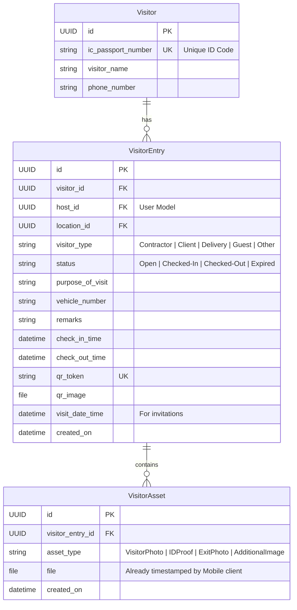

# GTMS Visitor Management Module: AI/ML-Powered Implementation Plan

This revised implementation plan outlines the database architecture, API designs, screen workflows, and project timelines for the **GTMS Visitor Entry & Visitor Management Module**. 

It incorporates a backend-only AI pipeline using **YOLOv8-nano** and **PaddleOCR** to auto-detect vehicle license plates and ID numbers, and provides a clear strategy for classifying and parsing different international ID cards.

---

## 1. AI/ML Extraction Pipeline (Backend-Only)

We will implement a modular image-processing pipeline in Python on the Django backend using two open-source frameworks:
* **YOLOv8-nano (Ultralytics)**: A lightweight object detection model (approx. 6MB) used to localize regions of interest (e.g., license plates or ID text zones) in under 50ms on a standard CPU.
* **PaddleOCR**: A highly accurate OCR engine used to extract text strings from cropped bounding boxes.

### Pipeline A: Vehicle License Plate Detection & Extraction
For vehicle photos captured during entry or exit:
```
[Raw Vehicle Image] 
       │
       ▼ (YOLOv8-nano)
[Detect Bounding Box of License Plate]
       │
       ▼ (Image Crop)
[Cropped License Plate Image]
       │
       ▼ (PaddleOCR)
[Raw Text: "W N D 12 3 4"]
       │
       ▼ (RegEx Cleansing)
[Extracted Plate: "WND1234"]
```
1. **YOLOv8-nano Localization**: The backend runs the uploaded vehicle photo through a pre-trained YOLOv8-nano model fine-tuned for license plate detection. It returns the coordinates `[x_min, y_min, x_max, y_max]` of the license plate.
2. **Cropping**: Python's `Pillow` library crops the image to the plate boundaries.
3. **Text Extraction**: The cropped image is passed to PaddleOCR to read the characters.
4. **Post-Processing**: RegEx strips non-alphanumeric characters, corrects common OCR substitutions (e.g., `O` $\rightarrow$ `0`, `I` $\rightarrow$ `1`), and returns the cleaned plate number.

---

### Pipeline B: ID Card Classification & Extraction (Solving the ID Doubt)
**The Challenge:** Since PaddleOCR extracts raw text lines, how do we distinguish between an Indian Driving License, Malaysian MyKad, or a Passport, and isolate the correct ID number?

**The Solution:** We will implement a **Dual-Verification Strategy** combining **Document Hinting** (Primary) and **RegEx Pattern Classifiers** (Secondary).

#### 1. Document Hinting (Metadata-driven)
In the Web and Mobile manual check-in screens, when uploading an ID proof, the user is required to select the **Document Type** from a dropdown:
* Malaysian MyKad
* Indian Aadhaar
* Indian Driving License
* Passport
* Other ID

This selected value is sent to the backend as a string field (`document_type`) along with the image.

#### 2. RegEx Pattern Classifier (Backend Parser)
Based on the selected `document_type` (or as an auto-detect fallback if "Other" is chosen), the backend runs PaddleOCR on the card and applies specialized regular expression matchers:

```python
import re

def parse_extracted_text(text_lines, document_type):
    # Flatten text lines into a single searchable string
    full_text = " ".join(text_lines).upper().replace(" ", "")

    if document_type == "malaysian_mykad":
        # Matches Malaysian ID format YYMMDD-PB-### or YYMMDDPB### (12 digits)
        match = re.search(r"\b\d{6}-?\d{2}-?\d{4}\b", full_text)
        return match.group(0) if match else None

    elif document_type == "indian_aadhaar":
        # Matches 12-digit Indian Aadhaar card number
        match = re.search(r"\b\d{12}\b", full_text)
        return match.group(0) if match else None

    elif document_type == "indian_dl":
        # Matches Indian Driving License: State code (2 letters) + Year (2/4 digits) + 11 digits
        # Example: DL-1320110123456
        match = re.search(r"\b[A-Z]{2}-?\d{2}-?\d{11}\b", full_text)
        return match.group(0) if match else None

    elif document_type == "passport":
        # Matches standard passport formats: 1 letter + 7 or 8 digits
        match = re.search(r"\b[A-Z][0-9]{7,8}\b", full_text)
        return match.group(0) if match else None

    else:
        # Fallback Auto-Detection: Check all patterns in order of confidence
        for pattern in [r"\b\d{6}-?\d{2}-?\d{4}\b", r"\b\d{12}\b", r"\b[A-Z]{2}-?\d{2}-?\d{11}\b", r"\b[A-Z][0-9]{7,8}\b"]:
            match = re.search(pattern, full_text)
            if match:
                return match.group(0)
        return None
```

---

## 2. Relational Database Design

The database schema consists of three normalized tables in Django:



---

## 3. API Logical Workflows & State Machine

### Flow A: OCR Extract API (`POST /api/visitors/ocr-id/`)
Extracts text from uploaded ID documents:
* **Request**: Multipart Form:
  - `id_proof` (Image File)
  - `document_type` (String, e.g. `'malaysian_mykad'`, `'passport'`)
* **Logic**:
  1. Backend runs PaddleOCR on the image.
  2. Runs `parse_extracted_text` filter using the `document_type` metadata.
  3. Returns the extracted number string.
* **Response**: `{"success": true, "extracted_id": "950812105432"}`.

### Flow B: Vehicle Plate Extract API (`POST /api/visitors/detect-plate/`)
Extracts license numbers from vehicle photos:
* **Request**: Multipart Form containing `vehicle_image`.
* **Logic**:
  1. Runs YOLOv8-nano to detect license plate bounding box.
  2. Crops plate image using Pillow.
  3. Runs PaddleOCR on cropped image.
  4. Returns the plate number text.
* **Response**: `{"success": true, "plate_number": "WND1234"}`.

### Flow C: Manual Check-In API (`POST /api/visitors/checkin/`)
Handles manual entries:
* **Request**: Form fields containing visitor parameters and assets (`photo`, `id_proof`).
* **Logic**:
  1. Creates or updates the `Visitor` profile.
  2. Maps to an existing `'Open'` invitation if found, updating status to `'Checked-In'` and setting `check_in_time = now()`.
  3. If no open invitation exists, creates a new `VisitorEntry` (status `'Checked-In'`), generating a unique `qr_token` and `qr_image` checkout pass.
  4. Saves images in the `VisitorAsset` table.

### Flow D: Single QR Scan API (`POST /api/visitors/qr-scan/`)
* **Scan 1 (Status: `'Open'`)**: Returns pre-populated invitation details to show the Check-In form.
* **Scan 2 (Status: `'Checked-In'`)**: Returns status and redirects user to the Check-Out form.
* **Scan 3+ (Status: `'Checked-Out'` / `'Expired'`)**: Returns error: `{"error": "QR Code Expired / Invalid"}`.

---

## 4. Web Panel Screens

1. **Visitor History Page**: Lazy-loaded datagrid of entries, status filters, details drawer, and a **Mark Exit** button with optional exit image capture.
2. **Manual Entry Screen**: Registration form. Dropdown for `Document Type`. Selecting it and dropping the ID Proof triggers the backend OCR API and auto-fills the read-only IC number field. Includes a vehicle image scanner helper. Generates printable QR pass on check-in.
3. **Invitation Screen**: Standard scheduler form for hosts/HR generating `'Open'` entries and printable QR passes.

---

## 5. Schedules & Timelines (Table Format)

### Iteration 1: Manual Entry, Core Models, History, & Backend AI/ML Integration

#### Backend Tasks (Iteration 1)
| Task ID | Task Title | Description | Est. Duration |
| :--- | :--- | :--- | :--- |
| **B1.1** | DB Models & Migration | Scaffold Django app `visitor`. Create `Visitor`, `VisitorEntry`, `VisitorAsset` models. Run migrations. | 1.5 Days |
| **B1.2** | Search IC API | Build search-endpoint `GET /api/visitors/search-ic/?ic_number=<val>`. | 0.5 Day |
| **B1.3** | AI/ML Pipeline Setup | Set up YOLOv8-nano model loading and PaddleOCR packages in Django environment. | 1.0 Day |
| **B1.4** | OCR ID API | Implement `/api/visitors/ocr-id/` with RegEx classifiers for MyKad, Aadhaar, Driving License, and Passport. | 1.0 Day |
| **B1.5** | Vehicle Plate API | Implement `/api/visitors/detect-plate/` plate cropping and extraction pipeline. | 1.0 Day |
| **B1.6** | Check-in / Out APIs | Build manual check-in `POST /api/visitors/checkin/` (generates QR pass) and manual checkout `/api/visitors/entries/<entry_id>/checkout/`. | 1.0 Day |
| **B1.7** | History & Exports | Build paginated `/api/visitors/` history log (lazy loading) and `/api/visitors/export/` Excel download. | 1.0 Day |
| **Total** | | | **7.0 Days** |

#### Web Panel Tasks (Iteration 1)
| Task ID | Task Title | Description | Est. Duration |
| :--- | :--- | :--- | :--- |
| **W1.1** | Routing & Layout | Setup visitor routes in React Router, sidebar links, and overall layout framework. | 1.0 Day |
| **W1.2** | Manual Entry UI | Build registration form with Document Type selector, file uploads, OCR auto-extraction, vehicle plate scanner widgets, and QR display modal. | 1.5 Days |
| **W1.3** | Visitor History Grid | Implement paginated React datagrid table for visitor logs with search filters. | 2.0 Days |
| **W1.4** | Details Panel | Build detail view slider showing check-in/out logs, status, host info, and asset attachments. | 0.5 Day |
| **W1.5** | Mark Exit & Export | Add "Mark Exit" action button to table rows (pop-up form for optional photo) and link the Excel report download. | 1.0 Day |
| **Total** | | | **6.0 Days** |

---

### Iteration 2: Pre-Authorized Invitations & Scan Validation

#### Backend Tasks (Iteration 2)
| Task ID | Task Title | Description | Est. Duration |
| :--- | :--- | :--- | :--- |
| **B2.1** | Invitation API | Implement `/api/visitors/invitations/` to create invitations and generate QR badge images. | 1.5 Days |
| **B2.2** | Stateful QR Scan API | Build unified scanner `/api/visitors/qr-scan/` that returns details if Open, redirects to checkout if Checked-In, and rejects if Expired. | 1.5 Days |
| **B2.3** | Staff Lookup Directory | Create autocomplete directory helper endpoints to easily search hosts on Web. | 0.5 Day |
| **B2.4** | Integration Testing | Write API test scripts validating first-scan/second-scan behaviors, YOLO/OCR execution speed, and QR expiration. | 0.5 Day |
| **Total** | | | **4.0 Days** |

#### Web Panel Tasks (Iteration 2)
| Task ID | Task Title | Description | Est. Duration |
| :--- | :--- | :--- | :--- |
| **W2.1** | Invite Form Screen | Build Form Dialog for host/HR to schedule visitor details and host search fields. | 1.5 Days |
| **W2.2** | QR Invite Pass View | Design printable invitation card layout displaying guest QR pass with PNG download. | 1.0 Day |
| **W2.3** | Active Invitations List| Create datagrid showing active scheduled visits with an option to expire/cancel invitations manually. | 1.5 Days |
| **Total** | | | **4.0 Days** |
