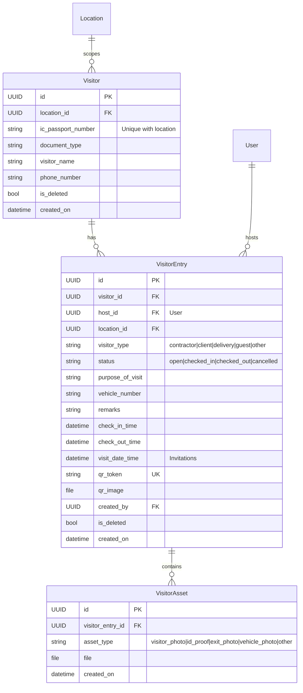

# GTMS Visitor Management — Implementation Plan

Revised plan for the **Visitor Entry & Visitor Management** module.

**Locked decisions**
- **Iteration 1 = manual only** (models + APIs + web). AI/OCR is **Iteration 2**.
- `ic_passport_number` is **unique per location** (not global).
- **QR expiry / Expired status** — deferred; revisit later.
- Walk-in check-in allowed without a prior invitation.
- When AI lands: OCR/plate results always **editable** (AI pre-fills; never blocks check-in).

Aligns with GTMS conventions: app prefix `/visitors/`, location scoping, soft delete, JWT auth, Excel export, `MOBILE_API_CURL.md`.

---

## Why this order (manual → AI)

| Approach | Verdict |
|----------|---------|
| **A. Manual first, AI second (this plan)** | **Preferred.** Core product (check-in/out, history, uniqueness, location scoping) ships without ML install risk. AI becomes a thin prefill layer on stable fields. |
| **B. AI + manual together in Iter 1** | Riskier. YOLO/PaddleOCR setup, timeouts, and CPU deps sit on the critical path and can delay a usable gatehouse flow. |

AI is an accelerator, not the source of truth. Staff must always be able to type IC / plate manually — so build that path first, then bolt OCR on.

---

## 1. Database design (Iteration 1)

Three tables in Django app `visitor`:



### Constraints & conventions
| Rule | Detail |
|------|--------|
| IC uniqueness | `UniqueConstraint(location, ic_passport_number)` where `is_deleted=False` (or equivalent) |
| Location scoping | Non-superuser locked to `request.user.location`; superadmin may pass `location_id` |
| Soft delete | `is_deleted` on Visitor / VisitorEntry |
| Status (v1) | `open` (invite), `checked_in`, `checked_out`, `cancelled` — **no `expired` yet** |
| QR | Generated on invite and/or check-in; reusable until checkout/cancel |
| Document type | Stored on `Visitor` for later OCR parsers; required or optional in manual form (product choice) |

---

## 2. API surface (GTMS style — `/visitors/`)

Auth: `Authorization: Bearer <token>` on all endpoints.

### Iteration 1 — Manual entry (no AI)

| Method | Path | Purpose |
|--------|------|---------|
| `GET` | `/visitors/search/?ic_number=` | Lookup visitor profile **in current location** |
| `POST` | `/visitors/entries/checkin/` | Walk-in check-in; multipart assets; IC / plate typed by user |
| `POST` | `/visitors/entries/<id>/checkout/` | Checkout; optional `exit_photo` |
| `GET` | `/visitors/entries/` | History: `date_filter`, `status`, `location_id`, `search`, pagination |
| `GET` | `/visitors/entries/export/` | Excel (same filters) |

### Iteration 2 — AI extraction (prefill helpers)

| Method | Path | Purpose |
|--------|------|---------|
| `POST` | `/visitors/ocr-id/` | Multipart: `id_proof`, `document_type` → `{ extracted_id, confidence?, raw_lines? }` |
| `POST` | `/visitors/detect-plate/` | Multipart: `vehicle_image` → `{ plate_number }` |

These endpoints **do not** create entries. Web/Mobile call them, then put results into the same manual check-in form fields (always editable).

### Iteration 3 — Invitations & QR scan

| Method | Path | Purpose |
|--------|------|---------|
| `POST` | `/visitors/invitations/` | Create `open` entry + QR |
| `GET` | `/visitors/invitations/` | List open/cancelled invites |
| `POST` | `/visitors/invitations/<id>/cancel/` | Cancel invite |
| `POST` | `/visitors/qr-scan/` | Token → payload by status (open → check-in form; checked_in → checkout; else error) |
| `GET` | `/visitors/hosts/` | Host autocomplete for location (or reuse existing user search) |

### Check-in logic (v1 — manual)
1. Resolve `location` from JWT (or superadmin param).
2. Upsert `Visitor` on `(location, ic_passport_number)`.
3. If matching `open` invitation for same visitor/location → set `checked_in`, `check_in_time=now()` (once Iter 3 exists; until then always create new entry).
4. Else create new `VisitorEntry` (`checked_in`) + QR if not present.
5. Save `VisitorAsset` rows (photo, id_proof, vehicle_photo as provided).

### QR scan logic (v3; expiry later)
- `open` → return invite details for check-in UI  
- `checked_in` → return entry for checkout UI  
- `checked_out` / `cancelled` → error  
- **Expired rules: out of scope for now**

---

## 3. AI/ML Extraction Pipeline (Backend-Only) — Iteration 2

Modular image pipeline on Django using:
- **YOLOv8-nano (Ultralytics)** — localize license plates (~6MB, CPU-friendly).
- **PaddleOCR** — read text from cropped regions / ID cards.
- **Pillow** — crop / light preprocess.

Models load **lazily** on first request (or app ready signal). On timeout/failure, APIs return `success: false` and the UI keeps manual entry.

### Pipeline A: Vehicle license plate

```
[Raw Vehicle Image]
       │
       ▼ YOLOv8-nano
[Plate bounding box]
       │
       ▼ Pillow crop
[Plate crop]
       │
       ▼ PaddleOCR
[Raw text]
       │
       ▼ RegEx clean (strip noise, O→0 / I→1 heuristics)
[plate_number]
```

### Pipeline B: ID card (document hint + regex)

User selects **Document Type** on Web/Mobile before/with upload:
- `malaysian_mykad`
- `indian_aadhaar`
- `indian_dl`
- `passport`
- `other`

Backend runs PaddleOCR, then document-specific parsers. `"other"` tries patterns in confidence order. Always return raw OCR lines for debugging if needed.

```python
def parse_extracted_text(text_lines, document_type):
    full_text = " ".join(text_lines).upper().replace(" ", "")

    if document_type == "malaysian_mykad":
        # YYMMDD-PB-#### (12 digits with optional dashes)
        match = re.search(r"\b\d{6}-?\d{2}-?\d{4}\b", full_text)
        return match.group(0) if match else None

    if document_type == "indian_aadhaar":
        match = re.search(r"\b\d{12}\b", full_text)
        return match.group(0) if match else None

    if document_type == "indian_dl":
        # e.g. DL-1320110123456
        match = re.search(r"\b[A-Z]{2}-?\d{2,4}-?\d{7,11}\b", full_text)
        return match.group(0) if match else None

    if document_type == "passport":
        match = re.search(r"\b[A-Z][0-9]{7,8}\b", full_text)
        return match.group(0) if match else None

    # other / fallback: try patterns in order
    for pattern in [
        r"\b\d{6}-?\d{2}-?\d{4}\b",
        r"\b\d{12}\b",
        r"\b[A-Z]{2}-?\d{2,4}-?\d{7,11}\b",
        r"\b[A-Z][0-9]{7,8}\b",
    ]:
        match = re.search(pattern, full_text)
        if match:
            return match.group(0)
    return None
```

**Ops notes (Iteration 2)**
- Pin versions in `requirements-visitor-ai.txt` (or extend main requirements).
- Document install CPU vs GPU; model weights path under `media/` or `static_models/`.
- Soft timeout (~5–8s); never hang check-in.
- Separate from existing face-attendance (`face_recognition` / FAISS) stack.
- Check-in/checkout APIs from Iter 1 stay unchanged; only web/mobile widgets call OCR helpers.

---

## 4. Web panel

**Top-level module** (like Incident), not only a Dashboard tab:
- Sidebar: **Visitor** (`Role.pages` + `menuConfig`)
- Routes: history, manual entry, invitations (Iter 3)

### Iteration 1 screens (manual)
1. **Manual Entry** — document type, IC/name/phone typed by user, optional ID/visitor/vehicle photo uploads, host, purpose, type → check-in → QR pass modal  
2. **Visitor History** — filters (date, status, search, location for superadmin), detail drawer, assets, **Mark Exit**, Excel export  

### Iteration 2 screens (AI on top of Iter 1 form)
- Same Manual Entry form: ID upload → OCR autofill (editable IC); optional vehicle photo → plate detect autofill  
- Failure / skip → user types as in Iter 1  

### Iteration 3 screens
3. **Create Invitation** — host search, visit datetime, visitor details, printable QR  
4. **Active Invitations** — list + cancel  

Reuse: `GTMSFilterBar`, export button pattern (Roll Call / Attendance), location org dropdown for superadmin.

---

## 5. Mobile (document early; implement with each iteration’s APIs)

| Iteration | Docs / APIs |
|-----------|-------------|
| **1** | Search IC, check-in / checkout (multipart), history if needed — `MOBILE_API_CURL.md` |
| **2** | Add OCR ID / detect plate curl examples; UI can trail web |
| **3** | QR scan |

Mobile UI can trail web slightly; **API contracts freeze per iteration**.

---

## 6. Schedules

### Iteration 1 — Models + manual APIs + web

#### Backend
| Task ID | Task | Description | Est. |
|--------|------|-------------|------|
| **B1.1** | App + models | `visitor` app, models, migration, `INSTALLED_APPS` + `/visitors/` urls, location util | 1.5d |
| **B1.2** | Search + check-in/out | IC search (location-scoped), checkin, checkout + assets + QR on check-in | 1.5d |
| **B1.3** | History + Excel | Paginated list + export | 1.0d |
| **B1.4** | Mobile curl docs | `MOBILE_API_CURL.md` for Iter 1 endpoints | 0.5d |
| **Total** | | | **~4.5d** |

#### Web
| Task ID | Task | Description | Est. |
|--------|------|-------------|------|
| **W1.1** | Routing + menu | Routes, sidebar, Role.pages label | 0.5d |
| **W1.2** | Manual Entry form | Full typed form + photo uploads + QR modal (no OCR yet) | 1.5d |
| **W1.3** | History grid | Filters, pagination, detail drawer | 2.0d |
| **W1.4** | Mark Exit + Export | Checkout action + Excel | 1.0d |
| **Total** | | | **~5.0d** |

**Iteration 1 calendar:** ~5–7 working days with BE/FE overlap. Gatehouse can go live on typed entry.

---

### Iteration 2 — AI service + wire into Manual Entry

#### Backend
| Task ID | Task | Description | Est. |
|--------|------|-------------|------|
| **B2.1** | AI env + loader | YOLOv8-nano + PaddleOCR install, lazy model load, health/fallback | 1.5d |
| **B2.2** | OCR ID API | `/visitors/ocr-id/` + document_type parsers | 1.0d |
| **B2.3** | Plate API | `/visitors/detect-plate/` YOLO crop + OCR + clean | 1.0d |
| **B2.4** | Docs + smoke | Curl examples; failure does not block check-in | 0.5d |
| **Total** | | | **~4.0d** |

#### Web
| Task ID | Task | Description | Est. |
|--------|------|-------------|------|
| **W2.1** | OCR + plate widgets | Call AI APIs; autofill editable fields; graceful fallback | 1.5d |
| **Total** | | | **~1.5d** |

**Iteration 2 calendar:** ~4–5 working days. No schema rewrite if Iter 1 fields already match (`document_type`, `ic_passport_number`, `vehicle_number`, assets).

---

### Iteration 3 — Invitations & QR scan

#### Backend
| Task ID | Task | Description | Est. |
|--------|------|-------------|------|
| **B3.1** | Invitation APIs | Create / list / cancel + QR badge | 1.5d |
| **B3.2** | QR scan API | Stateful scan (open / checked_in / reject) — **no expiry** | 1.0d |
| **B3.3** | Host lookup | Autocomplete by location (or wire existing users API) | 0.5d |
| **B3.4** | Tests | Check-in linking to invite, OCR smoke, QR path | 0.5d |
| **Total** | | | **~3.5d** |

#### Web
| Task ID | Task | Description | Est. |
|--------|------|-------------|------|
| **W3.1** | Invite form | Host search + schedule + QR download | 1.5d |
| **W3.2** | Active invites | List + cancel | 1.0d |
| **W3.3** | History polish | Link invite ↔ entry in drawer | 0.5d |
| **Total** | | | **~3.0d** |

---

### Later (explicitly deferred)

| Item | Notes |
|------|--------|
| **QR / visit expiry** | Status `expired`, Celery beat job, scan rejection rules |
| **Host WhatsApp notify** | Optional; reuse incident Twilio pattern (fail-open) |
| **PDF export** | Excel first; PDF can mirror Roll Call if needed |
| **Multi-visitor group visit** | Single visitor per entry in v1 |

---

## 7. Permissions & product rules

| Actor | Can |
|-------|-----|
| Location staff (page permission) | Manual entry, history, checkout; OCR helpers from Iter 2 |
| Host / HR (Iter 3) | Create/cancel invitations for own location |
| Superadmin | All locations via `location_id` |
| Mobile guard | Same location-scoped APIs |

---

## 8. Definition of done

### Iteration 1
- [ ] Walk-in check-in with photo + ID + optional vehicle works without invitation (all fields manual)
- [ ] IC unique **per location**; same IC allowed at another location
- [ ] History filters + Excel export
- [ ] Checkout with optional exit photo
- [ ] Location scoping enforced for non-superuser
- [ ] Soft delete on visitor/entry
- [ ] `MOBILE_API_CURL.md` published for Iter 1
- [ ] QR pass shown after check-in

### Iteration 2
- [ ] OCR ID + plate APIs return values; UI can edit/override
- [ ] AI failure does not block manual check-in
- [ ] Curl docs updated for OCR endpoints

### Iteration 3
- [ ] Create / list / cancel invitations + printable QR
- [ ] QR scan routes open → check-in / checked_in → checkout

---

## 9. Out of scope (this plan)

- Face matching visitors to employees  
- Geofence for visitors  
- Expired QR / auto-expire jobs  
- Global IC uniqueness  
